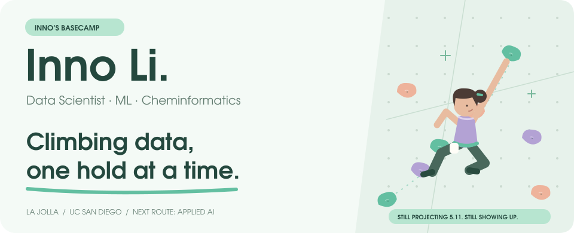
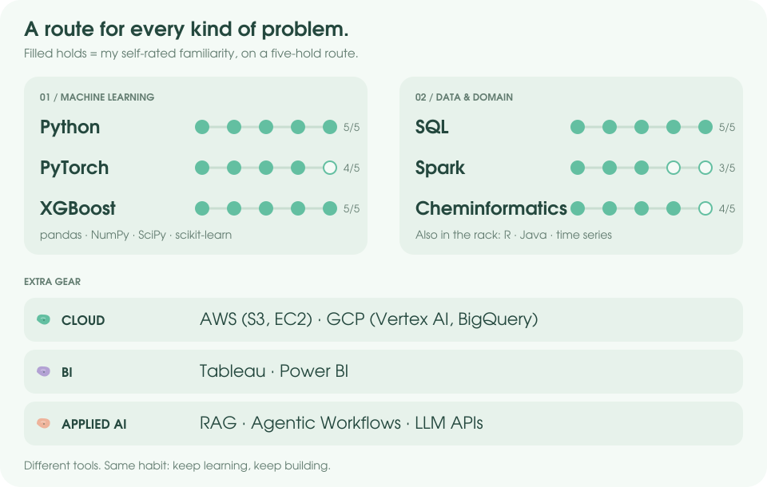

  <picture>
    <source media="(prefers-color-scheme: dark)" srcset="assets/hero-dark.svg" />
    
  </picture>
    
  <a href="https://www.linkedin.com/in/yinuo-li-inno">LinkedIn</a>
  &nbsp; · &nbsp;
  <a href="mailto:yil167@ucsd.edu">Email</a>
  <!-- Add a résumé link here when a public résumé file is ready. -->

## Current route

🎓 **UC San Diego · M.S. in Data Science (2025-2027) | B.S. in Math/Econ/Finance**  
🧪 **Previously AI for Ingredients @ dsm-firmenich**  
🎯 **Seeking new-grad roles in Data Science, ML, Applied AI, and Fintech**

## My gear rack

<picture>
  <source media="(prefers-color-scheme: dark)" srcset="assets/gear-dark.svg" />
  
</picture>

Unpack the rack

- **Languages & analysis:** Python (pandas, NumPy, SciPy), SQL, R, Java
- **Machine learning:** PyTorch, scikit-learn, XGBoost
- **Data & cloud:** Spark, AWS (S3, EC2), GCP (Vertex AI, BigQuery)
- **Visualization:** Tableau, Power BI
- **Applied AI:** RAG, Agentic Workflows, LLM APIs
- **Domain:** Cheminformatics, wearable time series

## The wall

**GitClimb** · My contribution graph, reimagined as a climbing wall.

Every active day places a hold. The climber finds a reachable route through my activity.

<picture>
  <source media="(prefers-color-scheme: dark)" srcset="https://raw.githubusercontent.com/Innoffline/Innoffline/output/climb-dark.svg" />
  <source media="(prefers-color-scheme: light)" srcset="https://raw.githubusercontent.com/Innoffline/Innoffline/output/climb.svg" />
  
</picture>

## Off the wall

🧗 **Climbing for 2 years**, still projecting 5.11.  
🎮 Strategist off the wall, **Fire Emblem** addict on the couch.  
🌊 Based in **La Jolla**, usually somewhere between a laptop and a climbing gym.

   
  <em>See you on the next route.</em>

